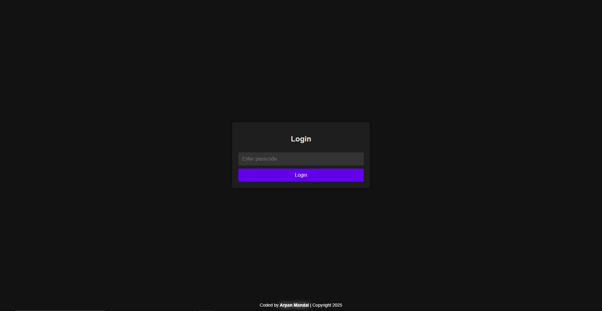

# **🔐 Defensive & Offensive Login System**  

A **dark-themed, professional, and secure** login page that requires a **SHA-256 encrypted passcode** for authentication. This system ensures that **unauthorized users cannot access protected content simply by URL jumping** and logs **IP & browser details** of failed login attempts.  

Designed for **privacy-focused** applications, this system is **lightweight, fast, and easy to integrate** with any website.  



---

## **🚀 Features**  
✔ **SHA-256 Encrypted Passcode Authentication** – Keeps your login system secure.  
✔ **Session-Based Authorization** – Blocks direct URL access to protected pages.  
✔ **Unauthorized Access Logging** – Logs IP & browser details of unauthorized users.  
✔ **Dynamic Login Notifications** – Alerts users of incorrect passcodes or unauthorized access attempts.  
✔ **Fully Hostable on Railway** – Designed to run on cloud hosting.  
✔ **Kept Online 24/7 with UptimeRobot** – Ensures continuous availability.  
✔ **Easily Integratable with Any Website** – Just drop your website files in `/home`.  
✔ **Dark, Professional & Minimal UI** – Aesthetically pleasing and modern.  

---

## **📂 Project Structure**  

```
/ (Root Directory)
│── /public
│   │── login.html      # Login page
│   │── style.css      # Stylesheet for login page
│   │── script.js       # Frontend scripts (notifications, effects)
│── /home
│   │── index.html      # Protected page (You can modify this with your own content)
│── app.js              # Main backend logic (Node.js with Express)
│── package.json        # Project dependencies
│── UserInfo.json       # Logs unauthorized access attempts (You may not create this file, it generates by itself after the first IP log)
```

---

## **🔧 Installation & Setup**  

### **1️⃣ Clone the Repository**  
```sh
git clone https://github.com/arpan-mandal/defensive-login-system
cd defensive-login-system
```

### **2️⃣ Install Dependencies**  
```sh
npm install
```

### **3️⃣ Start the Server**  
```sh
node app.js
```
By default, the server runs on **http://localhost:3000/**.  

---

## **🔑 Changing the Passcode**  

To **change the login passcode**, edit this line in `app.js [line 10]`:  

```js
const correctPasscode = 'PUT_YOUR_PASSCODE_HERE';
```
The passcode is **SHA-256 encrypted** before being verified which adds an extra layer of security.

---

## **🌐 How to Integrate this with your Website**  

If you have an existing website and want to **protect it with this login system**, follow these steps:  

1. **Replace `home/index.html`** with your website’s homepage.  
2. If your website has multiple pages, **place them all in the `/home` directory**.  
3. If using **CSS or JavaScript**, ensure the file paths are correctly set for `/home`.  
4. After logging in, users are redirected to `/home/index.html`. Everything inside `/home` remains **protected** from direct URL access.  

---

## **🖥️ Deploying on Railway**  

### **1️⃣ Create a Railway Project**  
- Go to **[Railway](https://railway.app/)** and create a new project.  

### **2️⃣ Link Your GitHub Repository**  
- Push your code to GitHub and connect it with Railway.  

### **3️⃣ Deploy the Server**  
- Click **Deploy**, and Railway will handle everything!  

### **4️⃣ Use UptimeRobot to Keep It Online**  
- **[UptimeRobot](https://uptimerobot.com/)** can send pings to your server every few minutes to **keep it running 24/7**.  

---

## **⚠️ Unauthorized Access Logging**  

Whenever someone:  
- **Attempts to login with a wrong passcode multiple times**  
- **Tries to access `/home` without logging in**  

Their **IP & Browser details** will be logged in `UserInfo.json`. Example log entry:  

```json
[
  {
    "timestamp": "2025-02-20T12:34:56Z",
    "ip": "192.168.1.1",
    "browser": "Mozilla/5.0 (Windows NT 10.0; Win64; x64)",
    "reason": "Wrong passcode attempt"
  }
]
```
📌 **Note:** <i>You can furthermore do a GeoLocation lookup on the logged IP to get accurate Location details of the users.</i>

---

## **📌 Final Notes**  

- **🔥 Highly Secure** – Blocks unauthorized access & logs intruders.  
- **⚡ Fast & Minimal** – No bloat, just what you need.  
- **🌍 Host Anywhere** – Works on Railway, VPS, or local server.  
- **🎨 Beautiful Dark UI** – Clean & professional design.  

---

## **👨‍💻 Credits**  

💻 **Developed by:** **[Arpan Mandal](https://arpanm.xyz/)**  
📅 **Copyright:** **© 2025 Arpan Mandal**  


> 🙌 If you found this useful, **drop a star ⭐ on this Repository!**  

---
